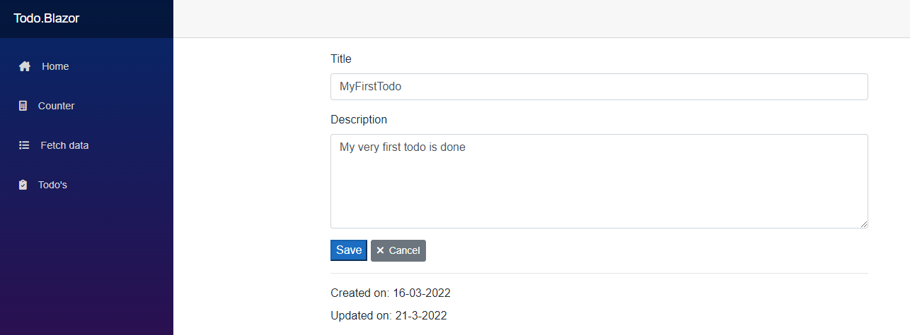

# Todo

Blazor Todo app (start-to-finish)

## Stap 1 - .NET Core 3.1 class Library project

1. Maak een nieuwe solution in VS genaamd `Todo`.

2. Maak een nieuw VS project. .NET Core 3.1 class library met de naam: `Todo.DataAccess`
3. Delete `Class1.cs`
4. Voeg de volgende drie NUGET packages toe:
    - https://www.nuget.org/packages/Microsoft.EntityFrameworkCore/5.0.9
    - https://www.nuget.org/packages/Microsoft.EntityFrameworkCore.Sqlite/5.0.9
    - https://www.nuget.org/packages/Microsoft.EntityFrameworkCore.Tools/5.0.9
5. Voeg twee nieuwe folders toe met de naam: `Models` en `Data`
6. Maak -in de folder- `Models` de volgende CS class:

```csharp
using System;

namespace Todo.DataAccess.Models
{
    // De naam van de class is tevens de naam van de tabel in de database.
    // Hier moet je van te voren goed over nadenken.
    public class ToDo
    {
        // Het Id (mits exact zo geschreven) wordt de primary key in de database
        public int Id { get; set; }
        public string Title { get; set; }
        public string Description { get; set; }
        public string DateCreated { get; set; }
        public string DateUpdated { get; set; }
    }
}
```

7. Maak in de folder `Data` de volgende CS class:

```csharp
using Todo.DataAccess.Models;
using Microsoft.EntityFrameworkCore;
using System;

namespace Todo.DataAccess.Data
{
    public class ApplicationDbContext : DbContext
    {
        public DbSet<ToDo> Todo { get; set; }

        protected override void OnConfiguring(DbContextOptionsBuilder optionsBuilder)
        {
            // Locatie naar de DB. Nu Sqlite. Maar dit kan ook SQL of MongoDB zijn.
            // Het werkt allemaal op dezelfde wijze.
            var conn = @"Data Source=c:\\temp\\Todo\\todo.db";
            optionsBuilder.UseSqlite(conn);
        }
    }
}
```

8. Open de `Package manager console` en type: `Add-Migration Initial`

9. Open de `Package manager console` en type: `Update-Database`.

Als alles goed is zou je nu in `c:\temp\Todo` een `todo.db` moeten zien staan met daarin een tabel `Todo`

10. Download DBBrowser for Sqlite van: https://sqlitebrowser.org/ of een Sqlite VSCode extension om te database te managen.

## Stap 2 - Toevoegen Blazor ServerSide App

1. Klik rechts op de solution en click op: `Add -> New project`.

2. Kies voor een: `Blazor ServerSide` of `Blazor Server App`.

3. Kies als naam voor het project: `Todo.Blazor`.

4. Bij `Additional information` selecteer:
    - .NET Core 3.1
    - Authentication: None
    - Configure for HTTPS

5. Zet de `Todo.Blazor` app als startup project.

6. Open de `Package manager console`.

7. Zorg dat je in de project root van `Todo.Blazor` staat en type: `dotnet watch run`

> dotnet watch run start de browser met de applicatie. Sluit de browser niet af!

8. Open `/Pages/_Host.cshtml`

9. Verander de `title` op regel 13 naar bv. `Todo`.

10. Save via `CTRL+S`.

11. Ga terug naar de browser en let op de title van de browser tab.

# Stap 3 - Aanpassen counter

> In VS: Open de `Package manager console`. Vanuit project root van `Todo.Blazor` type: `dotnet watch run`

1. Open de browser en ga naar de `Counter` pagina.

> Op dit moment doet de counter nog weinig, maar we kunnen er een UI element aan toevoegen.

2. Ga naar VS en open `Pages/Counter.razor`

3. Voeg op regel 8 de volgende code toe:

```html
    <input @bind="incrementBy"/>
```

4. Voeg in het `@code block` de volgende code toe:

```csharp
    private int incrementBy;
```

5. In de functie `private void IncrementCount()` wijzig ` currentCount++;` in:

```charp
    currentCount+=incrementBy;
```

6. Save via `CTRL+S`.

7. Browse naar de `Counter` pagina en zie dat er een nieuw UI element is bijgekomen.


# Stap 4 - Toevoegen db crud methodes

1. Open vanuit VS het project `Todo.Blazor`.

2. Voeg een nieuwe folder `Services` toe.

3. Maak een nieuwe CS Interface class. `IToDoService`.

```csharp
using Todo.DataAccess.Models;
using System.Collections.Generic;

namespace Todo.Blazor.Services
{
    public interface IToDoService
    {
        //Create
        ToDo Create (ToDo todo);

        //Read
        ToDo Get(int id);

        //Update
        ToDo Update(ToDo todo);

        //Delete
        void Delete(int id);

        //List
        List<ToDo> ListAll();
    }
}
```

4. Maak een nieuwe CS class. `ToDoService`

5. Inherit van: `IToDoService`.

```csharp
using Todo.DataAccess.Data;
using Todo.DataAccess.Models;
using System;
using System.Collections.Generic;
using System.Linq;

namespace Todo.Blazor.Services
{
    public class ToDoService : IToDoService
    {
        private readonly ApplicationDbContext _db;

        public ToDoService(ApplicationDbContext db)
        {
            _db = db;
        }

        public ToDo Create(ToDo todo)
        {
            todo.DateCreated = DateTime.Now.ToShortDateString();
            todo.DateUpdated = DateTime.Now.ToShortDateString();
            var newTodo = _db.Todo.Add(todo);
            _db.SaveChanges();

            return newTodo.Entity;
        }

        public void Delete(int id)
        {
            var todo = _db.Todo.Find(id);
            if (todo != null)
            {
                _db.Todo.Remove(todo);
                _db.SaveChanges();
            };
        }

        public ToDo Get(int id)
        {
            return _db.Todo.Find(id);
        }

        public ToDo Update(ToDo todo)
        {
            var dbTodo = _db.Todo.Find(todo.Id);
            if (dbTodo != null)
            {
                dbTodo = todo;
                dbTodo.DateUpdated = DateTime.Now.ToShortDateString();
                _db.SaveChanges();
            }

            return dbTodo;
        }

        public List<ToDo> ListAll()
        {
            return _db.Todo.ToList();
        }
    }
}
```

# Stap 5 - Setup Dependency Injection

1. Open vanuit VS het project `Todo.Blazor`.

2. Voeg de volgende twee NUGET packages toe aan het `Todo.Blazor` project.
    - https://www.nuget.org/packages/Microsoft.EntityFrameworkCore/5.0.9
    - https://www.nuget.org/packages/Microsoft.EntityFrameworkCore.Sqlite/5.0.9

> Zonder deze packages kun je de volgende stappen niet uitvoeren!

2. Open de file `Startup.cs`.

3. Op regel 32, voeg toe: `services.AddEntityFrameworkSqlite().AddDbContext<ApplicationDbContext>();`

4. Op regel 33, voeg toe: `services.AddScoped<IToDoService, ToDoService>();`

> Vergeet niet de using statements toe te voegen.

> Indien je een 'compile' error krijgt, sluit VS en start opnieuw!

```csharp
public void ConfigureServices(IServiceCollection services)
{
    services.AddRazorPages();
    services.AddServerSideBlazor();
    services.AddSingleton<WeatherForecastService>();
    services.AddEntityFrameworkSqlite().AddDbContext<ApplicationDbContext>();
    services.AddScoped<IToDoService, ToDoService>();
}
```

# Stap 6 - Voeg een record toe aan de Sqlite database

1. Open DBBrowser for Sqlite of execute via een VSCode extensions.

```sql
INSERT INTO Todo (Id,Title,Description,DateCreated,DateUpdated)
VALUES (1, 'MyFirstTodo', 'My very first todo', '16-03-2022', '16-03-2022');
```

# Stap 7 - Nieuwe razor pagina

> In VS: Open de `Package manager console`. Vanuit project root van `Todo.Blazor` type: `dotnet watch run`

1. Open VS. Maak in het project `Todo.Blazor` in de `Pages` folder een nieuwe folder met de naam: `Todo`.

2. Maak in de folder `Todo` een nieuw `Razor component` met de naam: `TodoList.razor`.

```html
@page "/todos"

@using DataAccess.Models;
@using Services;

@inject IToDoService _todoService

<h3>Todo's</h3>

<table class="table table-striped">
  <thead>
    <tr>
      <th scope="col">#</th>
      <th scope="col">Title</th>
      <th scope="col">Description</th>
      <th scope="col">DateCreated</th>
      <th scope="col">DateUpdated</th>
    </tr>
  </thead>
  <tbody>
    @if (!Todos.Any())
    {
        <tr>
            <th scope="row" colspan="5">No todo's are currently available</th>
            </tr>
        }

        else
        {
            foreach (var todo in Todos)
            {
                 <tr>
                    <th scope="row">@todo.Id</th>
                    <td>@todo.Title</td>
                    <td>@todo.Description</td>
                    <td>@todo.DateCreated</td>
                    <td>@todo.DateUpdated</td>
                </tr>
            }
        }
  </tbody>
</table>

@code {
    List<ToDo> Todos = new List<ToDo>();

    protected override async Task OnInitializedAsync()
    {
        Todos = _todoService.ListAll();
    }
}
```

3. Open file: `Shared/NavMenu.razor`.

4. In het code block van: `@NavMenuCssClass` voeg de volgende `NavLink` toe:

```html
<li class="nav-item px-3">
    <NavLink class="nav-link" href="todos">
        <span class="oi oi-task" aria-hidden="true"></span> Todo's
    </NavLink>
</li>
```

> Als alles goed is uitgevoerd zou je nu een tabel moeten zien met daarin de aangemaakte Todo in de database.


# Stap 8 - Voorbereiding TodoDetails razor page

1. Open file: `pages/Todo/TodoList.razor`.

2. Voeg toe op regel 7 de `navigionManager toe`.

```csharp
@inject NavigationManager _navigationManager
```

3. Pas regel 33 (binnen het `<tr>` block in de foreach) als volgt aan:

```html
<tr @onclick="() => RedirectTo(todo.Id)" class="cursor-pointer">
```

4. Voeg de volgende method toe op regel 61 (binnen het `@code` block):

```csharp
private void RedirectTo(int todoId)
{
    _navigationManager.NavigateTo($"/todo/details/{todoId}");
}
```

5. Open de file: `wwwroot/css/site.css`

6. Scroll naar het einde van de file en voeg toe op regel 184 de volgende css:

```css
.cursor-pointer {
    cursor: pointer;
}
```


# Stap 9 - Implementatie TodoDetails razor page

1. Maak in de folder `Todo` een nieuw `Razor component` met de naam: `TodoDetails.razor`.

```html
@page "/todo/details/{Id:int}"

@using DataAccess.Models
@using Services

@inject IToDoService _todoService
@inject NavigationManager _navigationManager

<div class="container d-flex justify-content-center m-0 p-0">
    <EditForm Model="@Todo" class="col-sm-12 col-md-10 col-lg-8 p-0">

        <div class="form-group">
            <label for="title">Title</label>
            <InputText id="title" @bind-Value="@Todo.Title" class="form-control" />
        </div>

        <div class="form-group">
            <label for="description">Description</label>
            <InputTextArea id="description" @bind-Value="@Todo.Description" class="form-control" rows="5" />
        </div>

        <div class="form-group">
            <a href="/todos" class="btn btn-sm btn-secondary"><i class="fas fa-times pr-2"></i>Cancel</a>
        </div>
        @if (Id != null)
        {
            <hr />
            <label>Created on: @Todo.DateCreated</label> <br />
            <label>Updated on: @Todo.DateUpdated</label>
        }
    </EditForm>
</div>

@code {
    [Parameter]
    public int? Id { get; set; }
    public ToDo Todo = new ToDo();

    protected override async Task OnInitializedAsync()
    {
        if (Id != null)
        {
            Todo = _todoService.Get(Id.Value);
        }
    }
}
```


# Stap 10 - Configureer blazored toast

1. Open het project `Todo.Blazor`

2. Installeer nuget package: `Blazored.Toast` https://www.nuget.org/packages/Blazored.Toast/3.2.2

3. Open cs file `Startup.cs`

4. Binnen de method `ConfigureServices` voeg op regel 37 de volgende code toe:

```csharp
 services.AddBlazoredToast();
 ```

> Importeer de juiste using statements!

5. Open de file `_Imports.razor`

6. Voeg de volgende twee regels code toe:

```csharp
@using Blazored.Toast
@using Blazored.Toast.Services
```

7. Open de file `_Hosts.cshtml`

8. Binnen het `<head></head>` code block, voeg de volgende regel code toe:

```html
<link href="_content/Blazored.Toast/blazored-toast.min.css" rel="stylesheet" />
```

9. Open de file `Shared\MainLayout.razor`

10. Voeg toe op regel op regel 6 (direct onder het `<div class="sidebar">/div` element)

```html
<BlazoredToasts Position="ToastPosition.BottomRight"
                Timeout="10"/>
```

> Importeer de juiste using statements!

# Stap 11 - Toevoegen FontAwesome icons

1. Open file `_Hosts.cshtml`

2. Binnen het `<head></head>` code block en direct onder de regel `<base href="/">` voeg de volgende regel code toe:

```html
<link rel="stylesheet" href="https://cdnjs.cloudflare.com/ajax/libs/font-awesome/6.0.0/css/all.min.css" referrerpolicy="no-referrer" crossorigin="anonymous" />
```

3. Open file `shared\NavMenu.razor`

4. Pas -op regel 12- de regel `<span class="oi oi-home" aria-hidden="true"></span> Home` naar:

```html
<span class="fa-solid fa-house-chimney pr-3" aria-hidden="true"></span> Home
```

5. Verander vervolgens resp.,
    - `oi oi-plus` naar: `fa-solid fa-calculator pr-3`
    - `oi oi-list-rich` naar: `fa-solid fa-list pr-3`
    - `oi oi-task` naar: `fa-solid fa-clipboard-check pr-3`

# Stap 12 - Implementeer update mogelijkheid

1. Open file `Pages\Todo\TodoDetails.razor`

2. Voeg een extra `@inject` statement toe op regel 7.

```charp
@inject IToastService _toastService
```

3. Pas de regel `<EditForm Model="@Todo" class="col-sm-12 col-md-10 col-lg-8 p-0">` regelnummer 11 als volgt aan:

```csharp
<EditForm Model="@Todo" OnValidSubmit="HandleOnValidSubmit" class="col-sm-12 col-md-10 col-lg-8 p-0">
```

4. Voeg toe op regel 24 (binnen de `div- class="formg-group"`)

```csharp
<button type="submit" class="btn-primary">Save</button>
```

> Er komt naast de `cancel` button dus een extra button bij.

5. Binnen het `@code{}` block op regel 36, voeg de volgende functie toe:

```
protected void HandleOnValidSubmit()
{
    try
    {
        _todoService.Update(Todo);
        _toastService.ShowSuccess("Todo successfully updated", "Succes!");

    }
    catch (Exception ex)
    {
        _toastService.ShowError($"Error saving todo. Error: {ex.Message}");
    }
}
```



# 13 - Implementeer create mogelijkheid

1. Open file `Pages\Todo\TodoList.razor`

2. Voeg toe direct onder het `<h3>Todo's</hr>` block:

```csharp
<button type="button" class="btn btn-sm btn-success" @onclick='() => _navigationManager.NavigateTo("todo/create")'>
    <i class="fas fa-plus pr-2"></i>Create
</button>
```

3. Open file `Pages\Todo\TodoDetails.razor`

4. Voeg op regel 2 een extra `page` statement toe.

```csharp
@page "/todo/create"
```

5. Pas de `form-group` buttons regel 24 als volgt aan:

```html
<div class="form-group">
    <button type="submit" class="btn btn-sm btn-primary" hidden="@(Id == null)"><i class="fas fa-save pr-2"></i>Save</button>
    <button type="submit" class="btn btn-sm btn-success" hidden="@(Id != null)"><i class="fas fa-plus pr-2"></i>Create</button>
    <a href="/todos" class="btn btn-sm btn-secondary"><i class="fas fa-times pr-2"></i>Cancel</a>
</div>
```

6. Pas binnen het `@code` block op regel 38, de functie `HandleOnValidSubmit` als volgt aan:

```csharp
protected void HandleOnValidSubmit()
{
    try
    {
        if (Id != null)
        {
            _todoService.Update(Todo);
            _toastService.ShowSuccess("Todo successfully updated", "Succes!");
        }
        else
        {
            _todoService.Create(Todo);
            _navigationManager.NavigateTo($"todo/details/{Todo.Id}");
            _toastService.ShowSuccess("Todo successfully created", "Succes!");
        }


    }
    catch (Exception ex)
    {
        _toastService.ShowError($"Error saving todo. Error: {ex.Message}");
    }
}
```

# Stap 14 - Implementeer delete

1. Open het project `Todo.Blazor`

2. Installeer nuget package: `Blazored.Modal` https://www.nuget.org/packages/Blazored.Modal/6.0.1

3. Open cs file `Startup.cs`

4. Binnen de method `ConfigureServices` voeg op regel 37 de volgende code toe:

```csharp
services.AddBlazoredModal();
 ```

> Vergeet niet de juiste using statements te importeren.

5. Open file `App.razor`

6. Wrap het `Router` code block in de volgende block:

```html
<CascadingBlazoredModal>
    <Router AppAssembly>
    ...
    </Router>
</CascadingBlazoredModal>
```

7. Open file `_Imports.razor` en voeg de volgende using statements toe:

```csharp
@using Blazored.Modal;
@using Blazored.Modal.Services;
```

8. Open file `_Hosts.cshtml`.

9. Voeg de volgende CSS toe aan de `headers`.

```html
<link href="_content/Blazored.Modal/blazored-modal.css" rel="stylesheet" />
```

10. Voeg in de body (direct onder `<script src="_framework/blazor.server.js"></script>`) de volgende regel toe:

```html
<script src="_content/Blazored.Modal/blazored.modal.js"></script>
```

11. Voeg onder `Pages` een nieuwe folder toe genaamd `Components`.

12. Maak een nieuw razor component met de naam `ConfirmationModal.razor`

```csharp
@page "/modal"

@using Services
@inject IToDoService _todoService;

<div class="container text-center">
    <div class="row">
        <div class="col">
            <h5>Are you sure you want to delete this todo?</h5>
        </div>
    </div>
    <div class="row mt-3">
        <div class="col text-center">
            <button type="button" class="btn btn-danger mr-3" @onclick="(async () => await DeleteTodo())">
                <i class="fas fa-trash pr-2"></i>Yes
            </button>
            <button type="button" class="btn btn-secondary mr-3" @onclick="(async () => await ModalInstance.CancelAsync())">
                <i class="fas fa-times pr-2"></i>Cancel
            </button>
        </div>
    </div>
</div>

@code {
    [CascadingParameter] BlazoredModalInstance ModalInstance { get; set; }
    [Parameter] public int TodoId { get; set; }

    private async Task DeleteTodo()
    {
        _todoService.Delete(TodoId);
        await ModalInstance.CloseAsync();
    }
}
```

13. Open de file `TodoDetails.razor.json`

14. Voeg een nieuwe button toe direct onder de `Cancel` button.

```html
<button type="button" class="btn btn-sm btn-danger float-right" hidden="@(Id == null)" @onclick="(async () => await ShowConfirmationModal())"><i class="fas fa-trash pr-2"></i>Delete</button>
```

15. In het `@code` block; voeg een nieuwe parameter toe.

```csharp
[CascadingParameter] IModalService Modal { get; set; }
```

16. Voeg als laatste stap de volgende functie toe:

```charp
private async Task ShowConfirmationModal()
{
    var parameters = new ModalParameters();
    parameters.Add("TodoId", Id);

    var confirmationModal = Modal.Show<ConfirmationModal>("Delete todo?", parameters);
    var result = await confirmationModal.Result;

    if (!result.Cancelled)
    {
        _toastService.ShowSuccess("Todo has been deleted!", "Success!");
        _navigationManager.NavigateTo("todos");
    }
}
```

> Vergeet niet de juiste using statements te importeren.